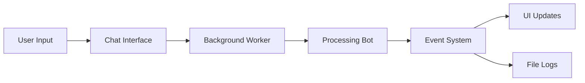

# Responsive Terminal Chat Interface

A demonstration of building a responsive terminal user interface that handles long-running processes while maintaining UI responsiveness. This project showcases the implementation of the Observer pattern, thread-safe UI updates, and event-driven architecture using Python and the Textual framework.




## Key Features
- 🖥️ Modern terminal user interface using Textual
- 🔄 Non-blocking background processing
- 📝 Real-time status updates
- 🧵 Thread-safe UI updates
- 📊 Event logging system
- 🎯 Clean separation of concerns

## Architecture

### Components
1. **ChatInterface**: Main TUI application
   - Handles user input
   - Manages background workers
   - Updates UI safely

2. **SimpleBot**: Processing engine
   - Implements Observer pattern
   - Emits processing events
   - Handles message processing

3. **Callback System**
   - TUI updates
   - File logging
   - Extensible observer pattern

## Installation

Clone the repository
```bash
git clone https://github.com/yourusername/responsive-chat-tui.git
```

Create and activate virtual environment

```bash
python -m venv .venv
source .venv/bin/activate # On Windows: .venv\Scripts\activate
```

Install dependencies

```bash
pip install -r requirements.txt
```

## Usage

Run the chat interface

```bash
python ui.py
```

### Key Commands
- Type your message and press Enter to send
- `Ctrl+Q` to quit
- `Ctrl+C` to quit (alternative)

## Project Structure

```
responsive-chat-tui/
├── ui.py        # Main application
├── bot.py       # Bot implementation
├── callbacks.py # Observer implementations
├── static/
│ └── styles.css # UI styling
└── events.log # Event log file (generated by events)
```

## Implementation Details

### Thread Safety

```python
def on_worker_state_changed(self, event: Worker.StateChanged) -> None:
    """Handle worker state changes in main thread."""
    if event.worker.state == WorkerState.SUCCESS:
    message_container = self.query_one("#message-container")
    message_container.mount(ChatMessage("Bot", event.worker.result))
```

### Observer Pattern

```python
class ChatCallback(ABC):
    @abstractmethod
    def on_event(self, event: ChatEvent, message: str) -> None:
        """Handle chat events."""
	pass
```

### Event System

```python
class ChatEvent(Enum):
    START_PROCESSING = "start_processing"
    THINKING = "thinking"
    PROCESSING_COMPLETE = "processing_complete"
    ERROR = "error"
```


## Design Patterns Used

1. **Observer Pattern**
   - Subject: SimpleBot
   - Observers: TuiCallback, FileLogCallback
   - Events: Processing status updates

2. **Worker Pattern**
   - Background processing
   - Non-blocking UI
   - Thread safety

3. **Event-Driven Architecture**
   - Loose coupling
   - Real-time updates
   - Extensible design


## Learning Resources

- [Textual Documentation](https://textual.textualize.io/)
- [Python Threading Documentation](https://docs.python.org/3/library/threading.html)
- [Observer Pattern](https://refactoring.guru/design-patterns/observer)

## License

This project is licensed under the MIT License - see the [LICENSE](LICENSE) file for details.

## Acknowledgments

- Textual framework team for their excellent TUI framework
- The Python community for inspiration and support

